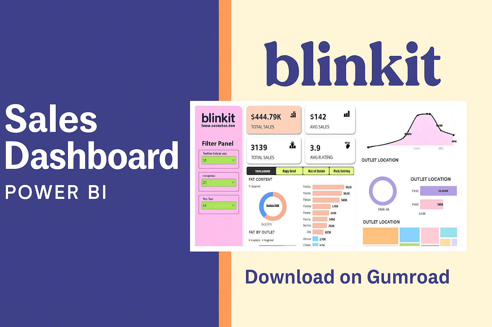

  

# Blinkit Sales Dashboard – Power BI Template

## 🚀 Overview
This Power BI dashboard visualizes key sales metrics for Blinkit, India’s “Last Minute App,” across outlet types, sizes, and product categories. It’s designed for retail analysts, business managers, and data enthusiasts seeking actionable insights from outlet-level performance data.

## 🛠 Tools & Technologies
- Python (Pandas, NumPy, Matplotlib, Seaborn)
- Exploratory Data Analysis (EDA)
- Tableau (Dashboard development)
- Data Cleaning & Preprocessing

## 🧠 Design Rationale
#📐 Layout Strategy
- Top-Level KPIs: Positioned for quick executive overview
- Filter Panel: Left-aligned for intuitive interaction
- Charts Grouped by Theme:
- Time-based trends (line chart)
- Product attributes (donut + bar charts)
- Outlet segmentation (tier and type breakdowns)
  
##🎨 Visual Choices
- Color Coding: Consistent use of brand colors for clarity
- Chart Types:
- Line Chart for temporal trends
- Donut Charts for categorical proportions
- Horizontal Bars for ranked comparisons
- Typography: Clean, legible fonts for dashboard readability
  
##📊 Data Storytelling
- Highlights the dominance of Low Fat products in sales
- Reveals outlet performance by Tier and Type
- Surfaces underperforming categories (e.g., Seafood, Breakfast)
  
---
## 🎯 Key Features
- Total Sales Overview: $444.79K across all small outlets
- Outlet Filters: Location Type, Outlet Size, Item Type
- Performance KPIs:
- Total Sales, Average Sales, Number of Items, Average Rating
- Time Series Analysis: Sales trends from 2012 to 2020
- Product Breakdown: Sales by Fat Content, Item Type
- Outlet Segmentation: Tier-wise sales and outlet type comparisons

---
## 📊🛠️ How to Use
- Open the .pbix file in Power BI Desktop
- Use filters to explore outlet performance by size, location, and item type
- Customize visuals or connect to your own dataset if needed
  
---
## 📂 Repository Structure
  ├──Dashboard_Cover.png 
  ├──Blinkit_Dashboard_Walkthrough.mp4 
  └──README.md                     # Project documentation

---
## 👩‍💻 Author
**Munawer Jabeen**  
📧 Email: munawerjabeen703@gmail.com  

🎯 Want the full interactive dashboard?
Download it on Gumroad[https://munawer3.gumroad.com/l/pywpt]

---
⭐ If you found this project helpful, feel free to star the repository!
